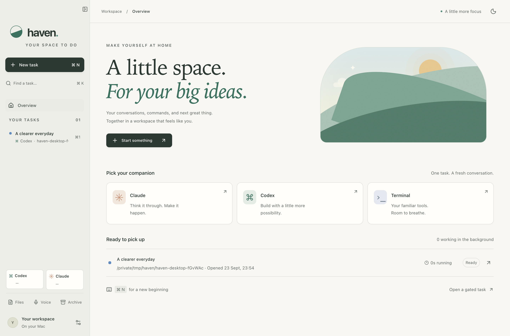
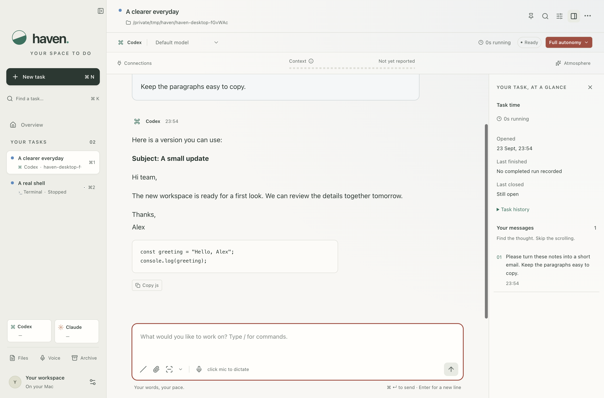
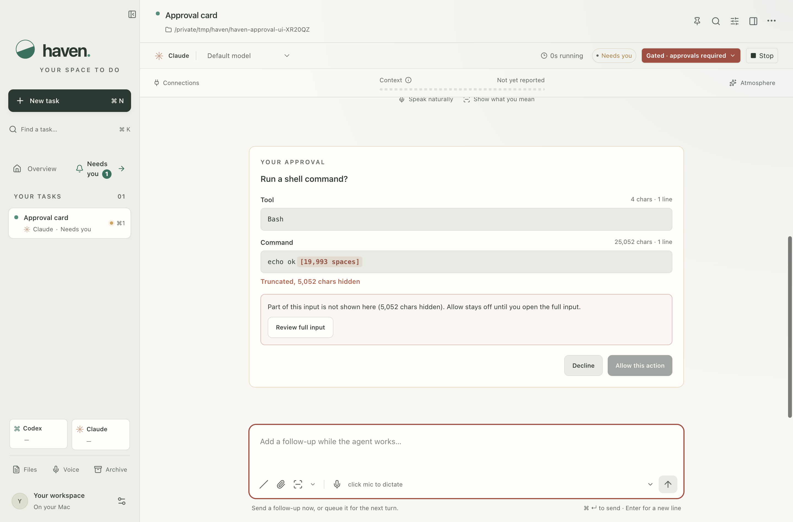
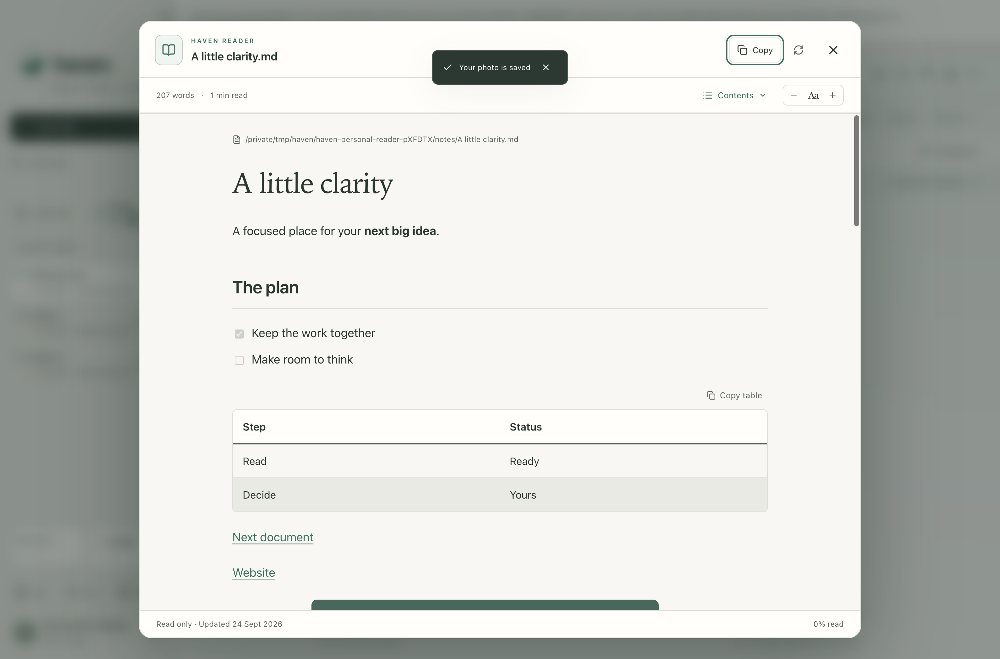
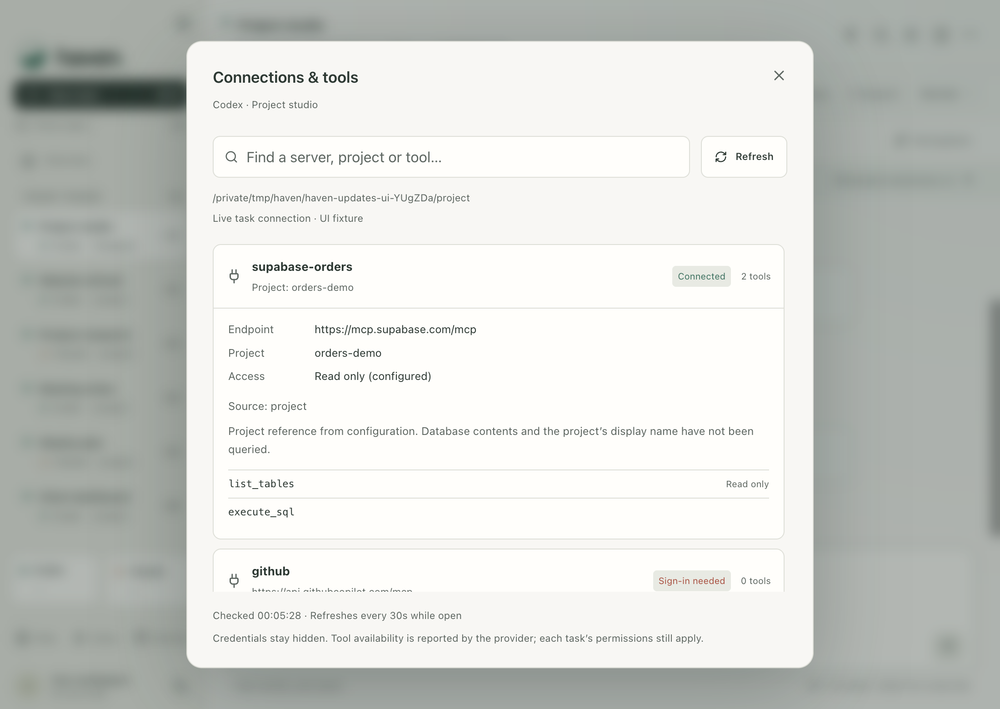
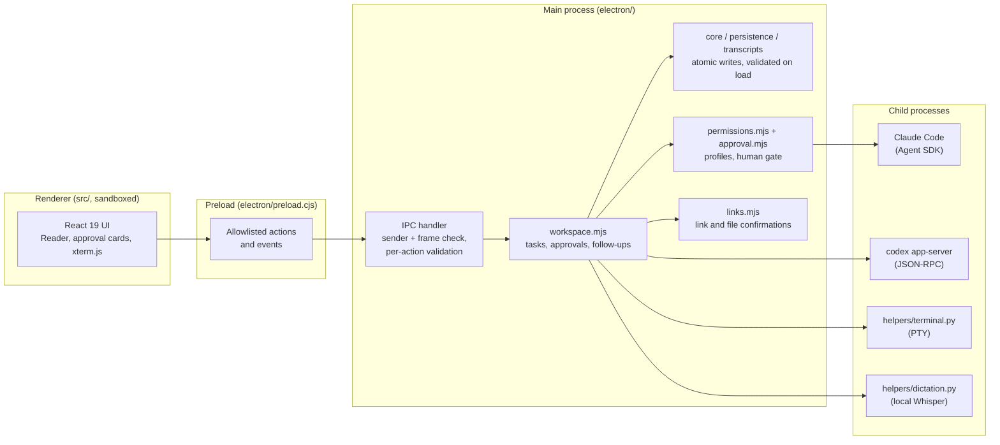

# Haven

A calm macOS workspace for Claude Code, Codex and real terminals, side by side as named tasks.



## Why it exists

I run five or more coding agents and shells at once. Terminal tabs made that hard to read, hard to copy from and hard to keep track of. Haven gives each piece of work its own task: a name, a folder, an agent or a shell, and a conversation you can actually read, select and copy.

It drives the Claude and Codex CLIs you already have installed, with your existing sign-ins, skills and project instructions. Haven needs no API keys and runs no server of its own.

## Features

**Tasks**
- Named tasks, each with a working folder and either Claude, Codex or a real zsh terminal.
- Sidebar with pinning, drag to reorder, `⌘1` to `⌘9` switching, a "Needs you" shortcut to tasks waiting on an answer, and `⌘K` search across tasks and conversations.
- Close, reopen, archive, restore and delete (with confirmation). Deletion only touches Haven's own data.
- Task time: opened, finished, closed and archived timestamps, plus accumulated agent or terminal runtime.
- Per-task colour, font, text size and an optional animated background. Light, dark and system themes; reduced-motion support.
- Closing the window keeps tasks running; a menu-bar item brings it back. Quitting warns about active work.

**Claude and Codex**
- Claude runs through the Claude Agent SDK; Codex runs through its app-server protocol. Both keep their own sign-ins, settings and skills.
- Per-task model and reasoning-effort switching, with models discovered from each installed CLI.
- Permission profiles per task: your existing settings, full autonomy, or a **gated** Claude profile where every shell call, write and MCP call waits for your approval in Haven. Changes made mid-turn apply to the next turn.
- Follow-up messages while an agent works: send into the running turn or queue for the next one. Queued messages survive a restart paused and are never re-sent automatically.
- A `/` command picker. Haven's own commands (`/model`, `/effort`, `/status`, `/stop`, `/rename`, `/pin`, `/archive`, `/connections` and more) run locally; provider skills go through each provider's native dispatch.
- Conversations resume the provider session on your next message after a restart.
- One-click provider updates that refuse to run while that provider has active work.

**Usage at a glance**
- A context-window meter per task, from what each provider reports.
- Account usage indicators for Claude and Codex plan windows, refreshed in the background and marked when stale or unavailable.

**Connections panel**
- See the MCP servers and tools a task can reach: status, endpoint, project reference and tool list. Credentials, headers and environment values are never passed to the UI.

**Haven Reader and files**
- Open Markdown, text, JSON, YAML, CSV and TSV files in a focused reader with contents, reading progress and adjustable type. CSV and TSV render as filterable tables.
- Formatted, selectable messages. Copy as plain text, Markdown or rich text; code blocks and tables have their own copy buttons.
- Paste or drop files, or capture a screen area or the Haven window into the composer, then annotate with boxes, arrows and labels before sending.

**Real terminals**
- Terminal tasks are real PTY-backed zsh sessions rendered with xterm.js, so your aliases and scripts work as usual.

**Local dictation**
- Push-to-talk with right Option or Fn, or `⌘⇧Space` to toggle, using local Whisper models. No speech API; audio stays in memory.
- Personal vocabulary and exact "when it hears this, use that" corrections.
- Text goes into your draft and is never sent automatically.

**Profile and shared folders**
- Your name and photo on your messages and in the sidebar.
- When several agent tasks share a folder, Haven watches file changes and gives the next message a short note of what changed. It's a heads-up, not file locking.

## Screenshots

| | |
| --- | --- |
|  |  |
|  |  |

Screenshots come from the Playwright suites running against the source build with throwaway data.

## Architecture



- **Main process** owns all state and every child process. The renderer never touches the filesystem or spawns anything.
- **Providers** (`electron/agents.mjs`): the Claude adapter wraps the installed Claude Code through `@anthropic-ai/claude-agent-sdk`, streaming events and routing approval callbacks to the UI. The Codex adapter speaks JSON-RPC to `codex app-server`. Child processes get an allowlisted environment, not your full login environment.
- **Permissions** (`electron/permissions.mjs`): maps each profile to SDK options. The gated profile uses a `PreToolUse` hook as the human gate, so allow rules can't skip it.
- **Validation** (`electron/validation.mjs` and each IPC action): everything loaded from disk and everything received over IPC is checked in the main process.
- **Renderer** (`src/`): React 19 with Radix dialogs and menus, Tailwind v4, xterm.js and react-markdown. Streaming sends small per-task patches rather than full state.

## Security

Haven hands real shells and coding agents to a UI, so most of the design is about keeping the human in charge of what runs.

**The approval card shows the decisive input.** In the gated profile, and for any approval Claude or Codex asks for, the card shows what would actually run: the shell command, the file path and change, or the MCP server, tool and arguments, inline and in monospace. Long whitespace runs appear as visible markers, so nothing hides past the edge. A Codex command's arguments are shell-quoted, so where one argument ends and the next begins is always visible, and the card names the folder it runs in. If an input is too long to show in full, the card says how many characters are hidden and **Allow stays off until you open the full input**. The main process enforces that, not just the button.

**The gate can't be skipped.** The gated profile runs a `PreToolUse` hook on every tool call. User-level allow rules don't bypass it, MCP servers other than the one you chose for the task are denied without a prompt, and trust is keyed on the server's reported source, so a server named like another can't borrow its identity. Channel plugins are off unless you opt in with `HAVEN_GATED_CHANNELS`, and they are matched by exact plugin name.

**File reads are scoped to the task folder.** Silent reads in the gated profile (`Read`, `Grep`, `Glob`) only run inside the task folder, with symlinks resolved to their real paths. Anything outside, such as `~/.ssh` or another project, goes through the approval card. The normal profile adds no allow rules of its own.

**Folder trust before project hooks and MCP servers.** The SDK skips Claude Code's own workspace-trust prompt, so Haven has its own. Normal Claude tasks load a folder's project settings, hooks and `.mcp.json` servers only after you trust that folder. Trust is stored by real path, and changing it restarts the connection. Background model and usage discovery load user settings only.

**Links and files ask first.** Links in agent replies open only on click and show their destination. A link that looks like it carries data asks first and shows the full URL, since an agent can put what it has read into a URL: a long query string, a long or encoded-looking path segment or subdomain, or a very long address. Local files outside the task folder ask first with the full real path, and secrets folders and key files get a stronger warning. The same applies to links inside a document open in Haven Reader, judged against the task folder that holds it. Executables and unknown file types are revealed in Finder, never launched.

**Electron hardening.**
- The renderer runs with `sandbox: true`, `contextIsolation: true` and `nodeIntegration: false`, behind a strict Content Security Policy (`script-src 'self'`, no `object-src`, no remote connections).
- New windows are denied and navigation outside the app is blocked.
- IPC requests are accepted only from Haven's own window and frame, and each action validates its arguments.
- Packaged builds turn off the `RunAsNode`, `NODE_OPTIONS` and `--inspect` fuses and turn on ASAR integrity validation, so other local processes can't run code under Haven's macOS permissions. `scripts/signature-smoke.mjs` checks this.
- The Reader has no raw HTML path, and embedded images can't leave the document's folder.

**Dictation.** Whisper model files are checked against the SHA256 that Whisper publishes before they load, and the Python dependencies are pinned in `helpers/requirements.txt`.

**Privacy.** No telemetry, no analytics and no Haven server. Workspace data lives in `~/Library/Application Support/Haven/` as private-permission files (not encrypted; use FileVault). Installation backups are created outside any repository. Claude and Codex still talk to their own services, as they do in a terminal. macOS asks for Microphone, Screen Recording, Accessibility and Input Monitoring only when you use the related feature.

Found something? See [SECURITY.md](SECURITY.md).

## What I learned

Haven went through a full security review before this release. The fixes are in the code above; these are the lessons I'd carry into any agent host.

1. **An approval gate is only as honest as what it shows.** A tool name plus a collapsed, silently cut details view is really just "Allow?". The approver should see the operative field inline, and any truncation should be loud and block approval.
2. **"Read-only" isn't harmless in an agent.** Unscoped `Read`, `Grep` and `Glob` are silent access to every secret on disk. Least-privilege profiles should scope reads to the working folder.
3. **Embedding a CLI can skip its safety prompts.** Driving Claude Code through the SDK bypasses its interactive trust dialog, so a host app that loads project settings needs its own folder-trust step, or a cloned repo's hooks run on first contact.
4. **An Electron app holding macOS privacy grants needs its fuses flipped.** With `RunAsNode` on, any local process can borrow the app's microphone, screen and accessibility permissions.
5. **Trust by provenance, not by name.** Matching MCP tools by a name prefix lets a lookalike server borrow trust. Match exactly and check where the server came from.
6. **Links are an exfiltration channel.** An agent that has read something can put it in a URL. Show the destination and confirm when a link carries data.
7. **Keep sensitive data out of working trees.** Backups of agent conversations inside a repository are one `git add -f` or one agent `Grep` away from leaking.
8. **Sanitize screenshots, not just code.** A clean codebase can still ship a screenshot with private names in it. Retake them from the sanitized build.

## Build and run

Requirements: macOS on Apple Silicon, Node.js 25 (see `.nvmrc`), and the `claude` and/or `codex` CLIs installed and signed in. Dictation also needs Python 3 with the pinned packages (`python3 -m pip install -r helpers/requirements.txt`) and a Whisper model in `~/.cache/whisper`.

```sh
npm ci
npm run build     # typecheck renderer and main process, then build the renderer
npm test          # unit tests
npm run desktop   # launch the app from source
```

`node scripts/check.mjs <suites>` runs the Playwright desktop suites against a throwaway data directory (`HAVEN_TEST_MODE=1`), for example `node scripts/check.mjs desktop approval permissions`. `scripts/provider-smoke.mjs`, `scripts/skill-smoke.mjs` and `scripts/followups-live-smoke.mjs` make small real calls to your provider accounts.

### Optional configuration

| Variable | Purpose |
| --- | --- |
| `HAVEN_PROJECTS_LAUNCHER` | A shell file with lines like `name "$HOME/path"`; each becomes a project chip in the new-task dialog. |
| `HAVEN_GATED_MCP_CONFIG` | JSON file with an `mcpServers` object for the gated profile (default `~/.config/haven/gated-mcp.json`). Only project-scoped Supabase HTTP servers are offered, and only the one you pick is loaded. |
| `HAVEN_GATED_CHANNELS` | Claude channel plugins to enable in the gated profile, e.g. `plugin:telegram@claude-plugins-official`. Off by default. Channel messages come from outside, so treat them as untrusted input; replies and tool calls stay gated. |

### Packaging and signing

macOS keeps dropping privacy permissions for ad-hoc signed apps, so the package step signs with a stable self-signed identity called **Haven Local**. Create it once, with its key kept outside the repository:

```sh
export HAVEN_SIGNING_DIR="/absolute/path/outside/the/repo"
npm run signing:setup
npm run package                 # builds, packages and signs release/mac-arm64/Haven.app
node scripts/signature-smoke.mjs
```

After a successful import the setup deletes the plaintext private key, so the identity lives only in your login keychain (back it up). The certificate is trusted for code signing on this Mac only. The entitlements keep `disable-library-validation` because a self-signed identity has no Apple Team ID. This is not Developer ID signing or notarization.

## Status

A personal project that I use every day. macOS on Apple Silicon only, not notarized, no installer and no support promises.

## License

[MIT](LICENSE)
